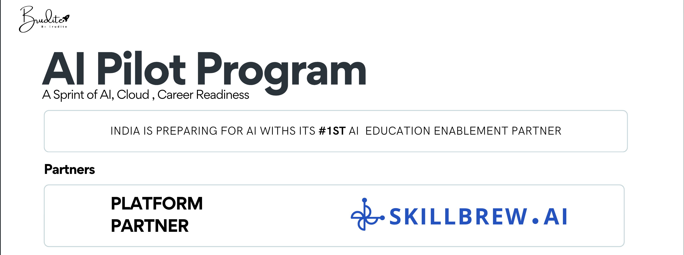

<table align="center">
  <tr>
    <td align="center"> <b>DevOps</b></td>
    <!-- <td align="center"> <b>Jenkins</b></td> -->
    <td align="center"> <b>Git</b></td>
    <td align="center"> <b>Cloud</b></td>
    <td align="center"> <b>AWS</b></td>
    <td align="center"> <b>Coding</b></td>
    <td align="center"> <b>Linkedin</b></td>
  </tr>
  
  
</table>

## Contents
- [Introduction](#welcome-to-the-ai-pilot-program-resource-hub)
- [Learning Platform](#get-started-your-onboarding)
- [Git and Github Setup Guide](#git-and-github-setup-guide)
- [Python Basics](#python-basics)
- [Python Framework: FastAPI](#python-framework-fastapi)
- [AWS Beginner Guide](#aws-beginner-guide)
- [Practice Box](#practice-box)
- [Project Repositories](#project-repositories)

## Welcome to the AI Pilot Program Resource Hub!

**AI-Pilot Program** is a 30-days hands-on, practice-driven initiative by **Brudite**, designed to help students strengthen their profiles, gain practical experience, and get excited about AI and cloud technologies.  

This repository contains all the **official learning materials** for the **AI-Pilot Program**.  

You’ll find **beginner-friendly guides**, **hands-on exercises**, and **related project code repositories**.

  
  
  
  
  

## Get Started your Onboarding

📌 Sign up, Somplete your profile, and kick off your AI enablement journey with <u><a href="https://www.skillbrew.ai">Skillbrew.ai ↗</a></u>

## [Git and Github Setup Guide](git/)

A version control system that helps you track changes in your code, collaborate with others, and manage projects efficiently. This section introduces you to Git and its commands, with step-by-step guidance.

You’ll learn:  
- **Installation** on Windows, macOS, and Linux  
- **SSH key setup** for secure authentication  
- **Cloning repositories** and understanding the basic workflow  
- **Essential Git commands** for daily usage  
- **Common issues and troubleshooting** (15 problems covered)

## [Python Basics](python-resources/)

Your **Langugae medium** in this program that helps you to collaborate, and talk with your system, AI, and your developer friends.

Start With:  
- **Python setup** on Windows, macOS, and Linux  
- **Data structures**: lists, tuples, dictionaries, sets, strings  
- **Object-Oriented Programming (OOP)**: classes, inheritance, polymorphism, encapsulation  
- **Functions**: definitions, decorators, lambdas, closures, generators  
- **Higher-order functions**: map, filter, reduce, sorting, composition  
- **Memory management**: references, garbage collection, copying  
- **File handling**: reading, writing, CSV, JSON, path management  
- **Common issues and solutions**: 15 problems with fixes  

##  [Python Framework: FastAPI](python-frameworks/)

**FastAPI: Your gateway to building modern, high-performance APIs with Python.**  

Start With:  
- Pydantic for data validation
- SQLAlchemy for database operations
- FastAPI for building APIs
- Complete applications and production patterns

##  [AWS Beginner Guide](aws/)
Master cloud computing with Amazon Web Services.

- Account setup and free tier
- Identity and Access Management (IAM)
- S3 storage for files and backups
- EC2 virtual servers
- Lambda serverless computing
- RDS and DynamoDB databases
- Console navigation and troubleshooting

##  Practice Box

Your daily pin points

## Project Repositories

- [Look-Alike](https://github.com/Brudite-Pvt-Ltd/Look-Alike)
- [Auto Job Apply System](https://github.com/Brudite-Pvt-Ltd/Auto-job-Apply-System)

## 📌 License

Copyright © 2025 **Brudite**.  
All rights reserved.  
This repository is part of the **AI-Pilot Program** by Brudite. Use the content for **learning and practice purposes only**.

